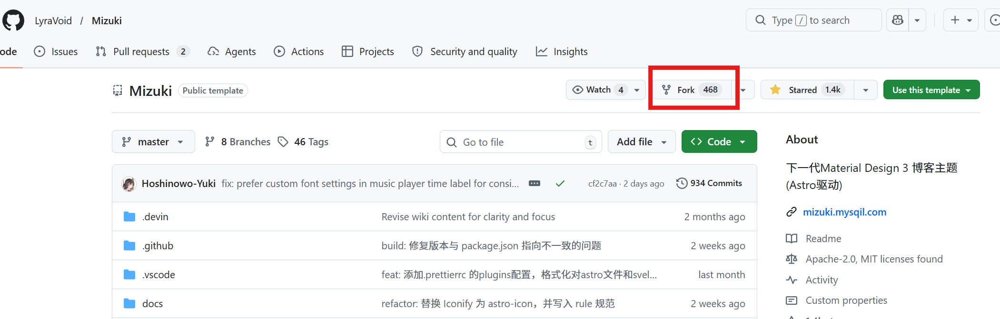
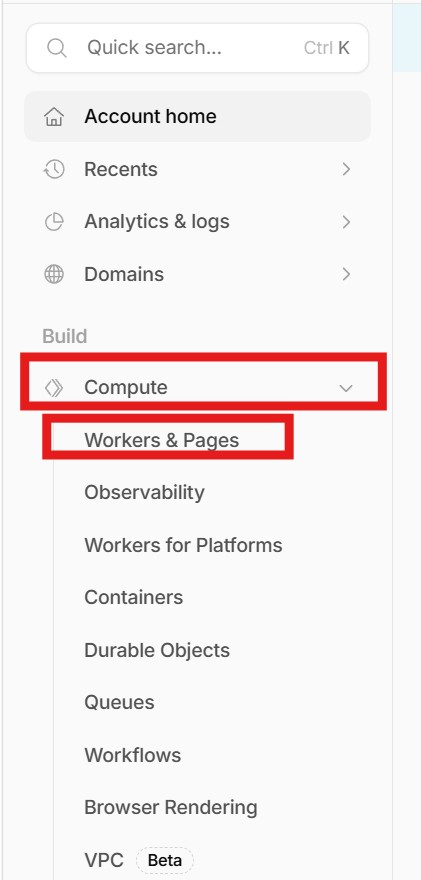
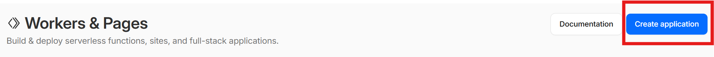
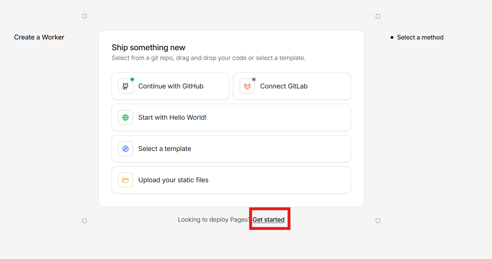
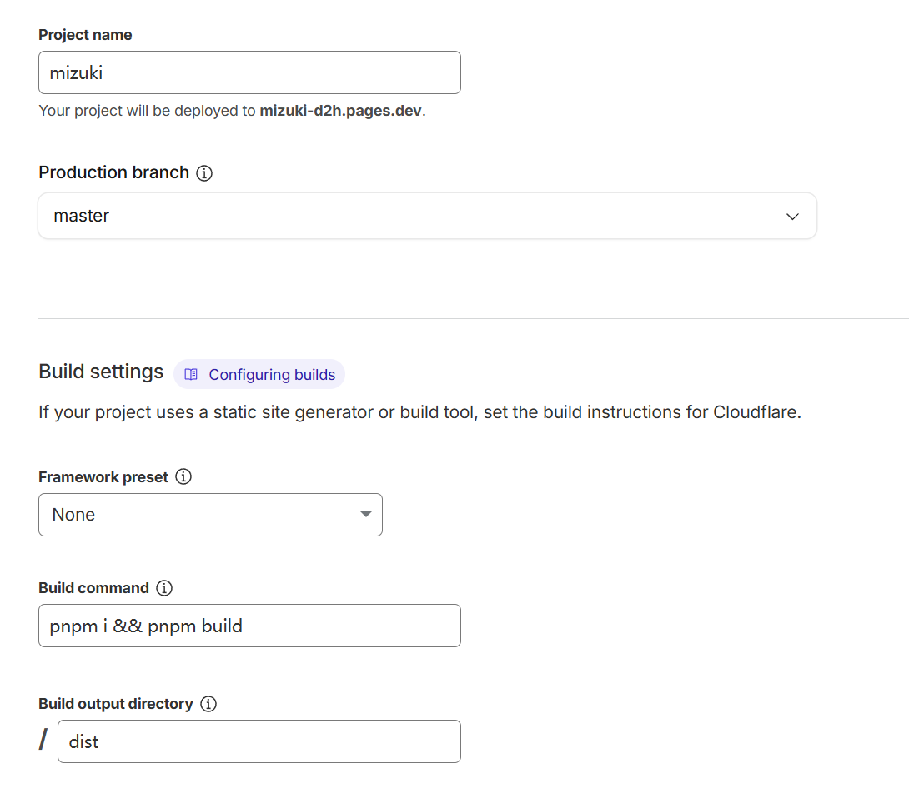
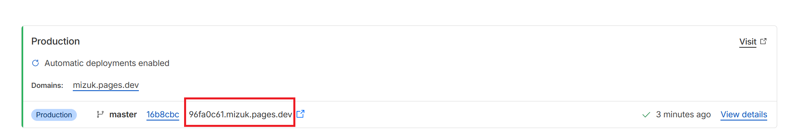
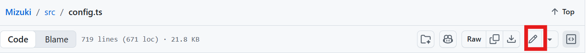

# 前言
如果你已经看完了我的上一篇文章 `Hexo + github pages 简易搭建备份（一）`,那么你可以通过这篇文章利用开源项目模板和 `cloudflare pages` 来搭建一个博客。


## 一、准备
1. 一个 `cloudflare` 账号
2. 一个 `GitHub` 账号

>`cloudflare pages` 是一个基于 `Git` 的静态网站托管服务，它的服务器部署范围相比 `github pages` 更广，所以他利于在国内搭建并访问你的静态博客，并且它允许你使用 `GitHub` 上的代码仓库来托管你的网站。

## 二、fork模板项目
> `fork` 是 `GitHub` 提供的功能，它可以将一个项目复制一份到你的仓库中，然后你就可以对复制的代码进行修改。
- 首先你需要在github或者b站上找到你喜欢的 `静态博客` 的 `开源模板`项目,一定要是开源的，下面这个是我认为比较好看并且编辑起来比较容易的模板，当然你也可以自己找
::github{repo="LyraVoid/Mizuki"}
官方文档 https://docs.mizuki.mysqil.com/guide/intro/


- 找到模板后打开它的github项目，然后点击 `fork` 按钮，再点击 `create fork` 按钮，将项目复制到你的仓库中




## 二、创建 `cloudflare pages` 项目
### 除了该教程，你还可以通过官方文档中的搭建教程来搭建，不过这篇文章可能会更详细一点
- 登录 `cloudflare` 账号，在侧边栏中依次点击 `Compute` -> `Worker & Pages` -> `Create Pages site`




- 点击`Get started` 按钮，选择 `Import an existing Git repository`,链接到你的 `github` 仓库，并在 `Select a repository` 下选择刚刚fork的仓库 `Mizuki` ,然后点击 `Begin setup` 按钮


- `Project name`中填入你的博客名称，其他配置如下
```
Build command: pnpm i && pnpm build
Build output directory: dist
Root directory: /
```


- 填好后点击`save and deploy` 按钮等待构建完成
- 如果你有自己的域名，那么你可以点击 `Add custom domain`根据指引添加自定义域名
- 如果没有则点击` Continue to project` 进行下一步，你可以看到cloudflare pages给你分配的域名



- 打开它你就可以访问你的博客了

## 三、配置博客
- 最重要的是你现在虽然已经部署了博客，但他现在只是一个模板，你需要在你 `Fork`的仓库里修改文件来配置博客, `github上的文件被修改后会被同步到cloudflare pages` 。

- 首先你需要在 `src/config.ts` 文件中修改博客的基本配（语言,博客URL,运行时间,标题，这些为基础配置，剩下的看情况自行修改）
  -点击这个按钮就可以编辑文件了
  
-剩下的你可以通过官方文档（https://docs.mizuki.mysqil.com/guide/intro/） 来学习怎样编辑你的博客，例如编辑某个界面 更换壁纸 编写文章等，这些 `都需要你在github中操作文件`

## 四、更方便的修改项目文件

- 你可以在计算机的任意文件夹中右键点击 `git bash`,在终端中输入
 ```
git clone 你的项目链接
```
把你的项目拉取到本地来修改，修改完成后执行
```
#与github上的文件比对，找到被修改的部分
git status
#把所有被修改的文件添加到上传队列
git add .
#上传更新日志
git commit -m "更新日志"
#上传文件到github
git push
```


## 参考
[github] Mizuki（https://github.com/LyraVoid/Mizuki/tree/master）
官方文档 https://docs.mizuki.mysqil.com/