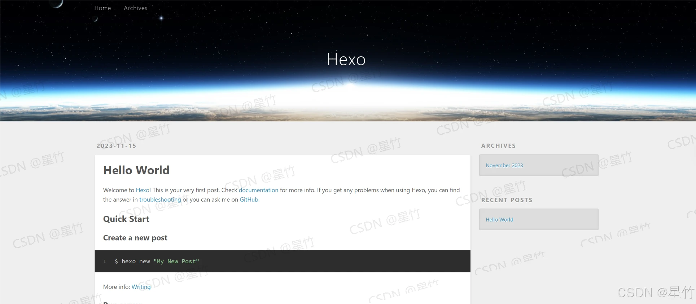
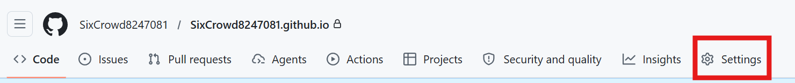
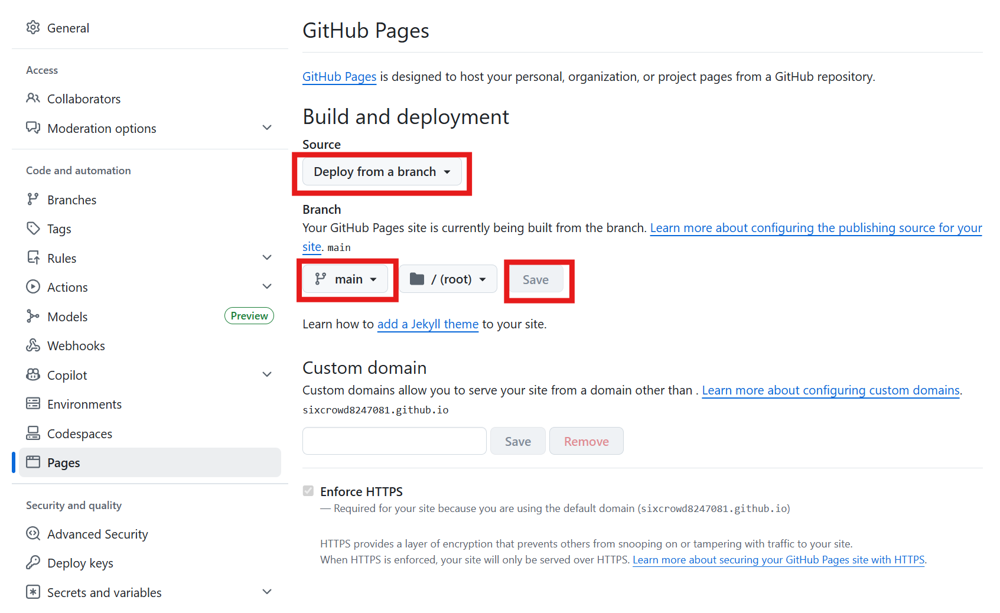
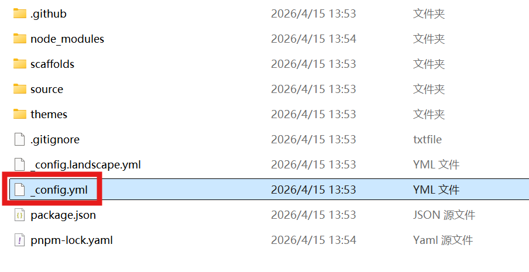
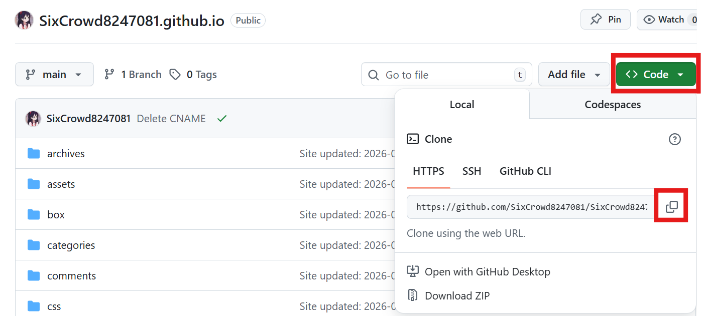
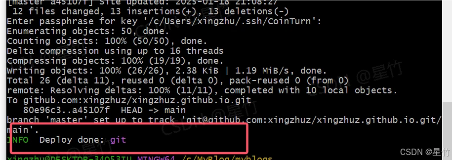

# 前言
如果你是一个小小白想免费搭建一个简易的博客，那么本篇教程则非常适合你。

它将教你如何使用 `Hexo + Github Pages` 搭建一个博客。
>`GitHub Pages` 是 `GitHub` 提供的免费静态网站托管服务，允许用户通过特定的 `GitHub` 仓库管理和托管自己的网站。
>`Hexo` 是一个简洁高效的博客框架，它使用 `MarkDown` 来编写博客，并生成静态页面。


## 准备工作
1. 一个 `GitHub` 账号
2. 一个域名（新人可以在阿里云1元注册一个top域名）用来替换 `Github` 的 `github.io` 域名（只是为了方便，可选）
3. 一台 `Windows` 电脑


## 操作步骤

### 一、配置本地环境
1. 安装 `Node.js`和 `Git`

按 `win +x` 打开终端管理员，输入以下命令回车安装 `Node.js`和 `Git`
```
winget install Git.Git
winget install OpenJS.NodeJS.LTS
```
等待安装完成后重新打开或新建终端，输入以下命令回车，返回三条版本号则安装成功
```
git --version
node --version
npm --version
```


### 二、本地创建Hexo项目
1.在任意目录创建一个空文件夹存放项目，比如我创建了一个 `MyBlog` 文件夹完整路径为 `D:\MyBlog` （路径不要包含中文）

2.创建完后，进入这个创建的文件夹，然后鼠标右击，点击 `Open Git Bash here`，进入git命令行界面，然后输入 `npm install -g hexo-cli` 安装 `Hexo` 命令行工具(复制代码不要用 `ctrl+c` 和 `ctrl+v` ，右键复制粘贴)

3.等待安装完成后，输入以下命令，它会新建一个 myblogs 文件夹，并自动安装 `Hexo` 项目所需的依赖项
```
# 新建项目myblogs
hexo init myblogs 
# 进入项目
cd myblogs
# 安装依赖项
npm i
```
4.完成以上操作后，输入 `hexo serve` 启动本地服务，访问 `http://localhost:4000` 出现以下界面则部署成功




### 三、创建Github仓库并上传项目
1.登录 Github，点击右上角的「 + 」按钮，选择「New repository」。

2.在 `Repository name` 填写仓库名称，格式为 `<username>.github.io` ，其中 `<username>` 是你的 Github 用户名, `Description` 为仓库描述可选填，将 `Add README` 设置为 `ON`，点击「Create repository」按钮创建仓库

3.进入新创建的仓库，点击 `Settings` 




4.在侧边栏选择 `Pages`，配置如图所示，点击 `Save`保存




5.浏览器访问你的项目名称`.github.io`，例如我的为 `SixCrowd8247081.github.io`，打开后显示你的项目名则配置成功

6.回到你的项目 `myblog` 文件夹,进入项目找到 `_config.yml` 文件并用记事本或vscode打开，编辑最后一段 `# Deployment`



将原始片段
```
# Deployment
## Docs: https://hexo.io/docs/one-command-deployment
deploy:
  type: ''
```
编辑为（！！！注意repo和branch的缩进与type平齐！！！）
```
# Deployment
## Docs: https://hexo.io/docs/one-command-deployment
deploy:
  type: git
  repo: 填入你的项目地址（如：https://github.com/SixCrowd8247081/SixCrowd8247081.github.io.git）
  branch: main
  ```
项目地址获取方式如图所示


7.在mylogs文件夹右键点击 `Open Git Bash here` 打开git命令行界面输入以下命令配置github
```
npm install hexo-deployer-git --save
git config --global user.name "你的用户名"
git config --global user.email "你的邮箱"
```
8.输入以下命令上传项目到github
```
# 清理 Hexo 缓存
hexo clean
# 重新生成静态文件
hexo generate
hexo deploy
```
执行时可能会跳转网页授权，最后出现 `Deploy Complete` 则上传成功,此时就可以使用域名访问了， `https://用户名.github.io` ，如果界面没改变，等个一两分钟即可


## 四、基本使用
1.进入github仓库，逐步进入`source/_posts`文件夹，创建一个文件，格式为 `命名.md`,然后按照以下格式编写，其中标题和时间是必需的
```
---
title: 标题
date: 2023-04-13
tags:
    - 标签1
    - 标签2
category: 分类
keywords: 
- 关键字1
- 关键字2
---
(文章内容)
```

`---`包裹起来的是前置信息，`---`外面则编写文章内容，可使用markdown语法编写


>### 该文章参考自
> https://www.cnblogs.com/xango/p/18909673